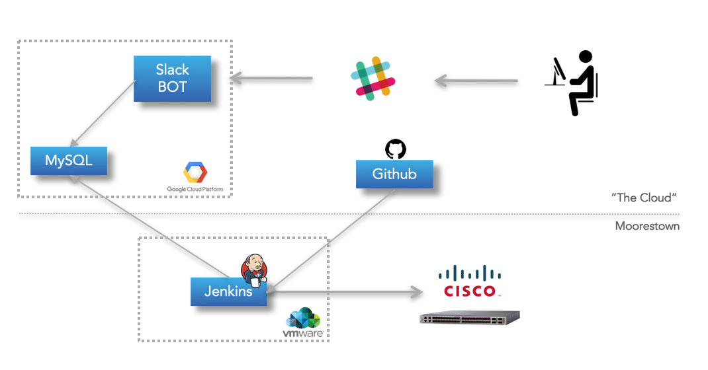

# Lab Inventory

Keeping track of lab inventory status with Slack as the user interface.



## Database

A MySQL DB example can be recreated with [GCP_import.sql](database/GCP_import.sql) in [GCP](https://cloud.google.com/sql/docs/mysql/import-export/importing#importing_a_sql_dump_file).

```sql
MySQL [lab_inventory]> SELECT * FROM device_table;
+--------------+----------+-------------+--------+--------+---------------+
| node         | sw_image | hardware    | config | user   | device_status |
+--------------+----------+-------------+--------+--------+---------------+
| mrstn-1002-1 | 6.2.25   | ASR-1002    | access | none   | offline       |
| mrstn-1002-2 | 6.5.1    | ASR-1002    | access | seyost | online        |
| mrstn-5501-1 | 6.5.2    | NCS-5501-SE | leaf   | nkumar | online        |
| mrstn-5501-2 | 6.2.1    | NCS-5501-SE | leaf   | nkumar | offline       |
| mrstn-5501-3 | 6.3.1    | NCS-5501-SE | leaf   | nleiva | online        |
| mrstn-5501-4 | 6.4.1    | NCS-5501-SE | leaf   | nleiva | online        |
| mrstn-5502-1 | 6.3.2    | NCS-5502-SE | spine  | seyost | online        |
| mrstn-5502-2 | 6.5.6    | NCS-5502-SE | spine  | nkumar | offline       |
| mrstn-5502-3 | 6.5.1    | NCS-5502-SE | spine  | nleiva | online        |
+--------------+----------+-------------+--------+--------+---------------+
```

## Enviroment variables requiered

### Slack BOT

- SLACK_TOKEN [E.g. xoxb-123456789]

### Cloud SQL

- USER [E.g. root]
- PASSWORD [E.g. mypassword]
- ADDRESS [E.g. 127.0.0.1:3306]
- DB [E.g. mydatabase]

## Running in Docker Containers

Setup your enviroment variables in `env.server`.

- Web Server

```bash
docker build -t webs -f ./webserver/Dockerfile .
docker run -t -p 8081:8081 --rm --name webserver webs
```

- Slack BOT

```bash
docker build -t server -f ./server/Dockerfile .
docker run -t --rm --name my-server --env-file ./env.server server
```
